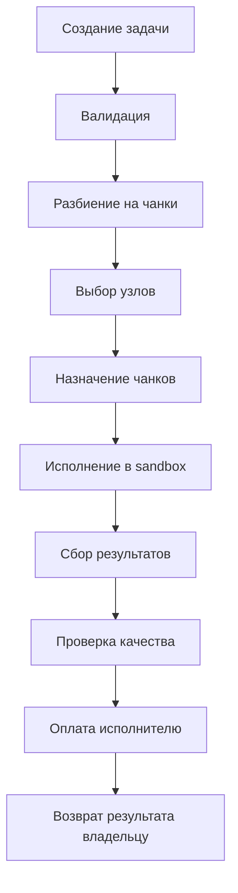

# 🏗️ Архитектура системы

## 📋 Содержание

- [Обзор архитектуры](#обзор-архитектуры)
- [Ключевые компоненты](#ключевые-компоненты)
- [Поток обработки задач](#поток-обработки-задач)
- [Типы узлов](#типы-узлов)
- [Протоколы взаимодействия](#протоколы-взаимодействия)
- [Безопасность](#безопасность)
- [Масштабируемость](#масштабируемость)

---

## 🎯 Обзор архитектуры

Децентрализованная P2P вычислительная сеть построена по принципу горизонтальной архитектуры с равноправными узлами, где каждый узел может быть как потребителем, так и поставщиком вычислительных ресурсов.

### Основные принципы

- **Равенство узлов** - все узлы имеют одинаковые права и возможности
- **Compute-кредиты** - система учета ресурсов без использования денег
- **Sandbox-изоляция** - безопасное исполнение кода в изолированной среде
- **Динамическое ценообразование** - адаптация цен под рыночные условия
- **Репутационная система** - защита от злоупотреблений и обеспечение качества

### Архитектурная схема

```
┌─────────────────────────────────────────────────────────────┐
│                     Децентрализованная сеть                   │
├─────────────────────────────────────────────────────────────┤
│  ┌─────────────┐  ┌─────────────┐  ┌─────────────┐          │
│  │   Узел 1    │  │   Узел 2    │  │   Узел 3    │  ...      │
│  └─────────────┘  └─────────────┘  └─────────────┘          │
│           │              │              │                   │
│  ┌─────────────────────────────────────────────────┐        │
│  │              P2P Сеть                           │        │
│  │  (Discovery, Routing, Message Passing)          │        │
│  └─────────────────────────────────────────────────┘        │
├─────────────────────────────────────────────────────────────┤
│                     Сервисы уровня                           │
│  ┌─────────────┐  ┌─────────────┐  ┌─────────────┐          │
│  │ Планировщик │  │ Мониторинг  │  │ Ценообразо- │          │
│  │   задач     │  │   сети      │  │    вание    │          │
│  └─────────────┘  └─────────────┘  └─────────────┘          │
├─────────────────────────────────────────────────────────────┤
│                      Ядро системы                            │
│  ┌─────────────┐  ┌─────────────┐  ┌─────────────┐          │
│  │   Узлы      │  │   Задачи    │  │ Кредиты     │          │
│  └─────────────┘  └─────────────┘  └─────────────┘          │
│  ┌─────────────┐  ┌─────────────┐  ┌─────────────┐          │
│  │ Репутация   │  │ Sandbox     │  │ Сеть        │          │
│  └─────────────┘  └─────────────┘  └─────────────┘          │
└─────────────────────────────────────────────────────────────┘
```

---

## 🔑 Ключевые компоненты

### 1. Узел сети (Node)

Основной компонент системы, представляющий собой вычислительный узел в сети.

#### Структура узла

```python
class Node:
    def __init__(self, node_id: str, host: str, port: int):
        self.node_id = node_id          # Уникальный идентификатор
        self.host = host                # Адрес для подключения
        self.port = port                # Порт для прослушивания
        self.capabilities = Capabilities() # Возможности узла
        self.peers = {}                 # Список связанных узлов
        self.tasks = {}                 # Активные задачи
        self.credits = Credits()        # Баланс compute-кредитов
        self.reputation = Reputation()  # Репутационный счет
```

#### Возможности узла

```python
class Capabilities:
    def __init__(self):
        self.cpu_score = 1.0           # CPU производительность
        self.ram_gb = 4.0              # Объем RAM в GB
        self.disk_gb = 100.0           # Объем диска в GB
        self.gpu_score = 0.0           # GPU производительность (если есть)
        self.cpu_usage = 0.0           # Текущая загрузка CPU
        self.ram_usage = 0.0           # Текущая загрузка RAM
        self.max_concurrent_tasks = 10 # Максимальное одновременных задач
```

### 2. Система P2P сети

Обеспечивает обнаружение узлов, маршрутизацию сообщений и поддержание сетевого соединения.

#### Компоненты P2P сети

```python
class P2PNetwork:
    def __init__(self, node: Node):
        self.node = node
        self.discovery = Discovery()     # Обнаружение узлов
        self.routing = Routing()         # Маршрутизация сообщений
        self.connections = {}            # Активные соединения
        self.message_queue = Queue()     # Очередь сообщений
```

#### Обнаружение узлов (Discovery)

- **UDP broadcast** - обнаружение в локальной сети
- **Bootstrap узлы** - доверенные точки входа в сеть
- **DHT (Distributed Hash Table)** - распределенная таблица маршрутизации
- **Mesh-топология** - полная децентрализация

#### Маршрутизация сообщений (Routing)

- **Distance Vector Routing** - алгоритм маршрутизации по вектору расстояния
- **Link State Routing** - алгоритм состояния связей
- **Adaptive Routing** - адаптивная маршрутизация с учетом загрузки
- **Failover** - автоматическое переключение при сбоях

### 3. Система задач (Task System)

Управляет жизненным циклом задач от создания до завершения.

#### Типы задач

```python
class TaskType(Enum):
    RANGE_REDUCE = "range_reduce"    # Операции над диапазонами
    MAP = "map"                      # Параллельное отображение
    MAP_REDUCE = "map_reduce"        # Map-reduce операции
    MATRIX_OPS = "matrix_ops"        # Операции с матрицами
    ML_INFERENCE = "ml_inference"    # ML инференс
    ML_TRAIN_STEP = "ml_train_step"  # Шаг ML обучения
```

#### Жизненный цикл задачи

```python
class Task:
    def __init__(self, task_id: str, owner_id: str, task_type: TaskType):
        self.task_id = task_id          # Уникальный идентификатор
        self.owner_id = owner_id        # Владелец задачи
        self.task_type = task_type      # Тип задачи
        self.status = TaskStatus.PENDING # Статус задачи
        self.requirements = {}          # Требования к ресурсам
        self.config = {}                # Конфигурация задачи
        self.chunks = []                # Чанки задачи
        self.results = []               # Результаты выполнения
        self.created_at = time.time()   # Время создания
        self.updated_at = time.time()   # Время последнего обновления
```

### 4. Система Compute-кредитов (Credits System)

Безденежная система учета вычислительных ресурсов.

#### Структура кредитов

```python
class Credits:
    def __init__(self, initial_balance: float = 100.0):
        self.balance = initial_balance          # Текущий баланс
        self.transaction_history = []           # История транзакций
        self.credit_pool = 0.0                  # Пул кредитов для задач
        self.max_balance = 10000.0              # Максимальный баланс
        self.min_transfer = 0.1                 # Минимальный перевод
```

#### Транзакции кредитов

```python
@dataclass
class CreditTransaction:
    transaction_id: str
    from_node: str
    to_node: str
    amount: float
    task_id: str
    timestamp: float
    type: str  # 'task_payment', 'transfer', 'reward', 'penalty'
```

### 5. Репутационная система (Reputation System)

Обеспечивает качество выполнения задач и защиту от злоупотреблений.

#### Структура репутации

```python
class Reputation:
    def __init__(self):
        self.score = 0.5                    # Текущий балл (0.0 - 1.0)
        self.level = "average"              # Уровень репутации
        self.history = []                   # История оценок
        self.metrics = {                    # Метрики репутации
            'success_rate': 0.0,           # Успешность выполнения
            'quality_score': 0.0,          # Качество результатов
            'consistency': 0.0,            # Последовательность
            'cooperation': 0.0             # Кооперативность
        }
        self.decay_rate = 0.01              # Скорость затухания
        self.reward_multiplier = 1.2        # Множитель вознаграждений
        self.penalty_multiplier = 1.5       # Множитель штрафов
```

#### Расчет репутации

```python
def calculate_reputation_score(self) -> float:
    """Расчет общего балла репутации"""
    
    # Веса для разных метрик
    weights = {
        'success_rate': 0.3,
        'quality_score': 0.25,
        'consistency': 0.2,
        'cooperation': 0.25
    }
    
    # Расчет взвешенной суммы
    total_score = 0.0
    for metric, weight in weights.items():
        total_score += self.metrics[metric] * weight
    
    # Применение временного decay
    time_factor = 1.0 - (self.decay_rate * time.time())
    final_score = max(0.0, min(1.0, total_score * time_factor))
    
    return final_score
```

### 6. Сandbox система (Sandbox System)

Обеспечивает безопасное исполнение кода задач в изолированной среде.

#### Типы изоляции

```python
class SandboxType(Enum):
    WASM = "wasm"                       # WebAssembly изоляция
    CONTAINER = "container"             # Container изоляция
    PROCESS_ISOLATION = "process_isolation" # Изоляция процессами
```

#### Ограничения и единый интерфейс

- `SandboxLimits` фиксирует доступные ресурсы (`cpu_time_seconds`, `memory_bytes`, `wall_time_seconds`, `file_size_bytes`, `open_files`, квоту рабочей директории и переменные окружения).
- `CodeBundle` описывает, что именно запускать (главный файл, дополнительные файлы/ресурсы, stdin, аргументы).
- Все песочницы наследуются от `SandboxExecutor` и реализуют метод `async execute(job, code_bundle, limits) -> SandboxResult`.
- `SandboxExecutorFactory.create()` скрывает выбор конкретной реализации, проверяет конфиг и возвращает готовый executor.

```python
from sandbox.execution import (
    SandboxExecutorFactory,
    SandboxLimits,
    SandboxType,
)

limits = SandboxLimits(cpu_time_seconds=30, memory_bytes=256 * 1024 * 1024)
executor = SandboxExecutorFactory.create(SandboxType.PROCESS_ISOLATION, limits)
result = await executor.execute(job, code_bundle)
```

`ProcessSandboxExecutor` применяет ограничения через `resource.setrlimit`, исполняет код во временной директории и собирает stdout/stderr. WASM и container песочницы пока представлены заглушками, но интерфейс у них идентичный, поэтому переключение типа не ломает остальную систему.

### 7. Система ценообразования (Pricing System)

Динамическое ценообразование на основе спроса, предложения и репутации.

#### Структура ценообразования

```python
class PricingEngine:
    def __init__(self):
        self.base_prices = {              # Базовые цены
            'cpu': 0.01,
            'gpu': 0.05,
            'ram': 0.02,
            'disk': 0.005
        }
        self.multipliers = {              # Множители
            'urgency': {
                'low': 0.8,
                'normal': 1.0,
                'high': 1.5,
                'critical': 2.0
            },
            'reputation': {
                'terrible': 1.5,
                'poor': 1.2,
                'average': 1.0,
                'good': 0.9,
                'excellent': 0.8
            }
        }
        self.market_conditions = 'normal' # Рыночные условия
        self.price_history = []           # История цен
        self.adjustment_rate = 0.1        # Скорость коррекции
```

#### Расчет стоимости задачи

```python
def calculate_task_price(self, task: Task, node_reputation: float) -> float:
    """Расчет стоимости выполнения задачи"""
    
    # Базовая стоимость
    base_cost = 0.0
    
    # Стоимость CPU
    cpu_cost = task.requirements.get('cpu_percent', 0) * self.base_prices['cpu']
    
    # Стоимость GPU
    gpu_cost = task.requirements.get('gpu_percent', 0) * self.base_prices['gpu']
    
    # Стоимость RAM
    ram_cost = task.requirements.get('ram_gb', 0) * self.base_prices['ram']
    
    # Стоимость диска
    disk_cost = task.requirements.get('disk_gb', 0) * self.base_prices['disk']
    
    base_cost = cpu_cost + gpu_cost + ram_cost + disk_cost
    
    # Множитель срочности
    urgency_multiplier = self.multipliers['urgency'].get(
        task.config.get('priority', 'normal'), 1.0
    )
    
    # Множитель репутации
    reputation_level = self.get_reputation_level(node_reputation)
    reputation_multiplier = self.multipliers['reputation'].get(reputation_level, 1.0)
    
    # Рыночный корректор
    market_adjustment = self.get_market_adjustment()
    
    # Финальная стоимость
    final_cost = base_cost * urgency_multiplier * reputation_multiplier * market_adjustment
    
    return max(0.01, final_cost)  # Минимальная стоимость 0.01
```

---

## 🔄 Поток обработки задач

### Полный жизненный цикл задачи



### Контур приватности вычислений

Перед тем как данные попадут на воркеров, планировщик анализирует `task.privacy` и применяет нужную стратегию:

- `shard` — входной массив режется на чанки, каждый Job/узел видит только свой фрагмент;
- `mask` — клиентский SDK или owner-узел маскирует данные (шум, линейные преобразования), воркер работает с зашумлённым payload;
- `mpc` — данные превращаются в криптографические шары, вычисление выполняет несколько воркеров совместно без доступа к полному секрету;
- `fhe` — воркеры исполняют операции над гомоморфно зашифрованными данными и не видят исходных значений.

Результаты подзадач могут дополнительно проверяться согласно `privacy["zk_verify"]` (репликация, контрольные вычисления, ZK-доказательства), поэтому заказчик получает корректный ответ, не раскрывая исходных данных.

### Job / JobResult слой

После подготовки задачи она разбивается на множество `Job` — компактных подзадач, каждая из которых содержит только свой `input_payload`. Воркеры возвращают `JobResult`, а координатор агрегирует их в финальный ответ. Такая декомпозиция облегчает шифрование/маскирование на уровне отдельных чанков и позволяет VerificationEngine сравнивать результаты реплик без раскрытия полного входа.

Каждый Task/Job проходит по стейт-машине:
`pending → scheduled → running → completed`, либо `failed / cancelled / expired` при ошибках.
Для Job ведётся счётчик попыток (`attempts`, `max_attempts`), поэтому при сбоях подзадача переходит в `failed` и автоматически переиздаётся до исчерпания лимита. Дубликаты результатов по одному `job_id` считаются идемпотентными: первая успешная попытка фиксируется, остальные сравниваются VerificationEngine (репликация, penalties).

#### Протокол обмена и транспорт

- Любое сетевое сообщение описывается `MessageEnvelope` (тип, ID, отправитель/получатель, timestamp, payload). Это даёт единый формат для P2P, gRPC и in-memory режимов.
- Полезная нагрузка каждого события задокументирована отдельными структурами (см. `core/protocol.py`): `JobAssignPayload`, `JobAckPayload`, `JobResultPayload`, `JobFailPayload`. Они сериализуются в dict/JSON и обратно.
- Состояния job'а формализованы в `core/job_state.py`. Комментарии рядом с enum фиксируют переходы: кто инициирует `ASSIGNED → ACKED`, когда возможно `EXPIRED`, и что считать финалом.
- Координатор управляет очередями через `TaskSchedulerState` (`core/scheduler_state.py`). `JobRecord` хранит последнюю попытку, worker, план на retry и позволяет выбрать записи, которые «протухли» и нуждаются в переотправке.
- Абстракция `Transport` определяет всего два метода: `send(dst, envelope)` и `register_handler(node_id, handler)`. Благодаря этому есть простая `InMemoryTransport`, позволяющая эмулировать связку «координатор ↔ воркер» внутри одного процесса без настоящей сети.
- `core/node.py` уже использует этот слой: `_on_transport_message` диспатчит `JOB_ASSIGN/JOB_ACK/JOB_RESULT/JOB_FAIL`, координаторский метод `assign_single_job_to_worker()` вырос до полноценной state machine с ретраями, начислениями кредитов и обновлением репутации.
- `tests/test_inmemory_two_nodes.py` поднимает два `ComputeNode` на одном транспорте, прогоняет happy-path и кейс с намеренным фейлом/ретраем — это гарантирует, что протокол работает даже без реального P2P.

### Подробные шаги

#### 1. Создание задачи

```python
async def create_task(self, task_data: Dict) -> Task:
    """Создание новой задачи"""
    
    # Валидация входных данных
    validation_errors = self.validate_task_data(task_data)
    if validation_errors:
        raise ValueError(f"Validation errors: {validation_errors}")
    
    # Создание объекта задачи
    task = Task(
        task_id=self.generate_task_id(),
        owner_id=task_data['owner_id'],
        task_type=TaskType(task_data['task_type']),
        requirements=task_data.get('requirements', {}),
        config=task_data.get('config', {})
    )
    
    # Инициализация чанков
    task.chunks = self.create_task_chunks(task)
    
    # Сохранение в систему
    self.tasks[task.task_id] = task
    
    return task
```

#### 2. Валидация задачи

```python
def validate_task_data(self, task_data: Dict) -> List[str]:
    """Валидация данных задачи"""
    
    errors = []
    
    # Обязательные поля
    required_fields = ['owner_id', 'task_type', 'requirements']
    for field in required_fields:
        if field not in task_data:
            errors.append(f"Missing required field: {field}")
    
    # Тип задачи
    try:
        TaskType(task_data['task_type'])
    except ValueError:
        errors.append(f"Invalid task type: {task_data['task_type']}")
    
    # Требования к ресурсам
    requirements = task_data.get('requirements', {})
    if 'cpu_percent' in requirements:
        if not 0 <= requirements['cpu_percent'] <= 100:
            errors.append("CPU percent must be between 0 and 100")
    
    if 'ram_gb' in requirements:
        if requirements['ram_gb'] <= 0:
            errors.append("RAM must be positive")
    
    return errors
```

#### 3. Разбиение на чанки

```python
def create_task_chunks(self, task: Task) -> List[Chunk]:
    """Разбиение задачи на чанки"""
    
    chunks = []
    
    if task.task_type == TaskType.RANGE_REDUCE:
        chunks = self.create_range_reduce_chunks(task)
    elif task.task_type == TaskType.MAP:
        chunks = self.create_map_chunks(task)
    elif task.task_type == TaskType.MAP_REDUCE:
        chunks = self.create_map_reduce_chunks(task)
    elif task.task_type == TaskType.MATRIX_OPS:
        chunks = self.create_matrix_chunks(task)
    elif task.task_type == TaskType.ML_INFERENCE:
        chunks = self.create_ml_inference_chunks(task)
    elif task.task_type == TaskType.ML_TRAIN_STEP:
        chunks = self.create_ml_train_chunks(task)
    
    return chunks
```

#### 4. Выбор узлов

```python
async def select_nodes_for_chunks(self, chunks: List[Chunk]) -> Dict[str, List[Chunk]]:
    """Выбор оптимальных узлов для чанков"""
    
    node_assignments = {}
    
    for chunk in chunks:
        # Поиск подходящих узлов
        suitable_nodes = await self.find_suitable_nodes(chunk)
        
        if suitable_nodes:
            # Выбор лучшего узла
            best_node = self.select_best_node(chunk, suitable_nodes)
            
            # Назначение чанка узлу
            if best_node not in node_assignments:
                node_assignments[best_node] = []
            node_assignments[best_node].append(chunk)
    
    return node_assignments
```

#### 5. Назначение чанков

```python
async def assign_chunks_to_nodes(self, task: Task, node_assignments: Dict[str, List[Chunk]]):
    """Назначение чанков узлам"""
    
    for node_id, chunks in node_assignments.items():
        # Проверка баланса узла
        if not self.can_afford_task(node_id, task):
            continue
        
        # Отправка чанков узлу
        for chunk in chunks:
            assignment = ChunkAssignment(
                chunk_id=chunk.chunk_id,
                task_id=task.task_id,
                assigned_node=node_id,
                status='assigned',
                assigned_at=time.time()
            )
            
            # Сохранение назначения
            self.chunk_assignments[chunk.chunk_id] = assignment
            
            # Отправка узлу
            await self.send_chunk_to_node(node_id, chunk, task)
```

#### 6. Исполнение в sandbox

```python
async def execute_chunk_in_sandbox(self, chunk: Chunk, node_id: str, task: Task):
    """Исполнение чанка в sandbox"""
    
    try:
        # Получение sandbox для узла
        sandbox = await self.get_sandbox_for_node(node_id)
        
        # Подготовка окружения
        await sandbox.prepare_environment(task, chunk)
        
        # Выполнение чанка
        result = await sandbox.execute_chunk(chunk, task)
        
        # Проверка результата
        if self.validate_chunk_result(result):
            # Сохранение результата
            chunk.result = result
            chunk.status = 'completed'
            chunk.completed_at = time.time()
            
            return result
        else:
            raise ValueError("Invalid chunk result")
            
    except Exception as e:
        # Обработка ошибки
        chunk.status = 'failed'
        chunk.error = str(e)
        raise
```

#### 7. Сбор результатов

```python
async def collect_task_results(self, task: Task) -> Dict:
    """Сбор результатов выполнения задачи"""
    
    results = []
    completed_chunks = 0
    failed_chunks = 0
    
    for chunk in task.chunks:
        if chunk.status == 'completed':
            results.append(chunk.result)
            completed_chunks += 1
        elif chunk.status == 'failed':
            failed_chunks += 1
    
    # Определение статуса задачи
    if failed_chunks > 0:
        task.status = TaskStatus.FAILED
        task.error = f"{failed_chunks} chunks failed"
    elif completed_chunks == len(task.chunks):
        task.status = TaskStatus.COMPLETED
        # Агрегация результатов
        task.result = self.aggregate_results(task.task_type, results)
    else:
        task.status = TaskStatus.RUNNING
    
    return {
        'task_id': task.task_id,
        'status': task.status,
        'completed_chunks': completed_chunks,
        'failed_chunks': failed_chunks,
        'total_chunks': len(task.chunks),
        'results': results,
        'aggregated_result': task.result
    }
```

---

## 🌐 Типы узлов

### 1. Seed-узел (Seed Node)

**Назначение:**
- Доверенные bootstrap узлы
- Источник правды о сети
- Подписывают конфигурации сети

**Требования:**
- Стабильное интернет-соединение
- Белый IP или проброшенный порт
- 24/7 доступность
- Высокая репутация

**Особенности:**
- Имеют сертификаты от root-ключа
- Могут отзывать недоверенные узлы
- Распространяют network_config
- Не выполняют пользовательские задачи

### 2. Публичный узел (Public Node)

**Назначение:**
- Узлы с белым IP
- Могут принимать подключения
- Участвуют в mesh-сетях
- Выполняют задачи

**Требования:**
- Публичный IP-адрес
- Проброшенный порт в роутере
- Стабильное соединение
- Достаточные вычислительные ресурсы

**Особенности:**
- Не имеют специальных привилегий
- Могут стать seed-узлами при необходимости
- Помогают в маршрутизации сообщений
- Получают compute-кредиты за выполнение задач

### 3. Клиентский узел (Client Node)

**Назначение:**
- Обычные пользователи
- Подключаются к существующей сети
- Могут быть за NAT
- Подают задачи на выполнение

**Требования:**
- Интернет-соединение
- Никаких специальных требований

**Особенности:**
- Автоматическое обнаружение сетей
- Поддержка NAT traversal
- Минимальные ресурсы
- Потребляют compute-кредиты

### 4. Специализированный узел (Specialized Node)

**Назначение:**
- Узлы с специфическими возможностями
- GPU ускорители
- Большая память
- Специфическое ПО

**Требования:**
- Специфическое оборудование
- Специальная конфигурация
- Дополнительное ПО

**Особенности:**
- Выполняют только определенные типы задач
- Получают повышенные compute-кредиты
- Могут иметь премиум-статус

---

## 🔌 Протоколы взаимодействия

### Формат сообщений

```python
@dataclass
class NetworkMessage:
    message_type: str        # Тип сообщения
    from_node: str           # Отправитель
    to_node: str            # Получатель (для broadcast = 'all')
    timestamp: float        # Время отправки
    message_id: str         # Уникальный ID сообщения
    data: Dict              # Данные сообщения
    signature: str          # Цифровая подпись
```

### Типы сообщений

#### 1. Сообщения управления

```python
# Handshake - установление соединения
{
    "type": "handshake",
    "node_pubkey": "base64...",
    "role": "client|public|seed",
    "version": "0.3.1",
    "capabilities": {...},
    "timestamp": 1234567890.123,
    "signature": "node_signature..."
}

# Ping/Pong - проверка доступности
{
    "type": "ping|pong",
    "from": "host:port",
    "timestamp": 1234567890.123,
    "signature": "signature..."
}

# Peer Discovery - обнаружение узлов
{
    "type": "peer_discovery",
    "known_peers": [{"node_id": "...", "host": "...", "port": "..."}],
    "timestamp": 1234567890.123,
    "signature": "signature..."
}
```

#### 2. Сообщения задач

```python
# Task Submission - подача задачи
{
    "type": "task_submission",
    "task_data": {
        "task_id": "...",
        "owner_id": "...",
        "task_type": "...",
        "requirements": {...},
        "config": {...}
    },
    "timestamp": 1234567890.123,
    "signature": "owner_signature..."
}

# Task Assignment - назначение задачи
{
    "type": "task_assignment",
    "task_id": "...",
    "chunk_id": "...",
    "assigned_node": "...",
    "execution_timeout": 300,
    "timestamp": 1234567890.123,
    "signature": "scheduler_signature..."
}

# Task Result - результат выполнения
{
    "type": "task_result",
    "task_id": "...",
    "chunk_id": "...",
    "result": {...},
    "execution_time": 2.5,
    "success": true,
    "timestamp": 1234567890.123,
    "signature": "worker_signature..."
}
```

#### 3. Сообщения кредитов

```python
# Credit Transfer - перевод кредитов
{
    "type": "credit_transfer",
    "from_node": "...",
    "to_node": "...",
    "amount": 10.5,
    "task_id": "...",
    "timestamp": 1234567890.123,
    "signature": "from_node_signature..."
}

# Credit Payment - оплата за задачу
{
    "type": "credit_payment",
    "from_node": "...",
    "to_node": "...",
    "amount": 5.0,
    "task_id": "...",
    "timestamp": 1234567890.123,
    "signature": "owner_signature..."
}
```

### Протокол безопасности

#### 1. Аутентификация

```python
async def authenticate_node(self, node_pubkey: str, signature: str, message: Dict) -> bool:
    """Аутентификация узла"""
    
    try:
        # Проверка подписи
        is_valid = self.verify_signature(node_pubkey, signature, message)
        
        # Проверка сертификата (для seed-узлов)
        if message.get('role') == 'seed':
            cert_valid = self.verify_seed_certificate(node_pubkey)
            return is_valid and cert_valid
        
        return is_valid
        
    except Exception as e:
        logger.error(f"Authentication failed: {e}")
        return False
```

#### 2. Шифрование

```python
def encrypt_message(self, message: Dict, recipient_pubkey: str) -> Dict:
    """Шифрование сообщения"""
    
    # Сериализация сообщения
    message_str = json.dumps(message, sort_keys=True)
    
    # Генерация ключа сессии
    session_key = os.urandom(32)
    
    # Шифрование сообщения
    cipher = AES.new(session_key, AES.GCM mode)
    ciphertext, tag = cipher.encrypt_and_digest(message_str.encode())
    
    # Шифрование сессионного ключа
    encrypted_key = RSA.encrypt(session_key, recipient_pubkey)
    
    return {
        'ciphertext': ciphertext.hex(),
        'tag': tag.hex(),
        'encrypted_key': encrypted_key.hex(),
        'nonce': cipher.nonce.hex()
    }
```

---

## 🔒 Безопасность

### Уровни безопасности

#### 1. Network Level

```python
class NetworkSecurity:
    def __init__(self):
        self.encryption = Encryption()      # Шифрование соединений
        self.authentication = Auth()       # Аутентификация узлов
        self.access_control = AccessControl() # Контроль доступа
        self.firewall = Firewall()         # Защита от DoS
```

**Механизмы:**
- TLS 1.3 для шифрования соединений
- X.509 сертификаты для аутентификации
- Белые списки для доступа к seed-узлам
- Rate limiting для защиты от DoS

#### 2. Task Level

```python
class TaskSecurity:
    def __init__(self):
        self.validation = TaskValidator()  # Валидация задач
        self.sandbox = SandboxSecurity()   # Безопасность sandbox
        self.resource_limits = SandboxLimits() # Лимиты ресурсов
        self.audit = TaskAudit()           # Аудит задач
```

**Механизмы:**
- Валидация входных данных задач
- Sandbox изоляция (WASM/Container/Process)
- Ограничение CPU, RAM, времени выполнения
- Запрет опасных операций (network, filesystem, shell)

#### 3. Data Level

```python
class DataSecurity:
    def __init__(self):
        self.encryption = DataEncryption() # Шифрование данных
        self.access_control = DataAccessControl() # Контроль доступа к данным
        self.audit = DataAudit()           # Аудит операций с данными
        self.backup = DataBackup()         # Резервное копирование
```

**Механизмы:**
- AES-256-GCM шифрование данных
- RBAC для доступа к данным
- Полный аудит всех операций
- Регулярное резервное копирование

### Конфигурация безопасности

```json
{
    "security": {
        "network": {
            "encryption": {
                "enabled": true,
                "algorithm": "TLS_1.3",
                "certificate_path": "certs/node.crt",
                "private_key_path": "certs/node.key"
            },
            "authentication": {
                "method": "certificate",
                "require_seed_signature": true,
                "trusted_roots": ["root_ca.pem"]
            },
            "access_control": {
                "allow_anonymous": false,
                "require_whitelist": true,
                "whitelist_file": "security/whitelist.json"
            }
        },
        "task": {
            "validation": {
                "max_input_size": 1000000,
                "allowed_operations": ["math", "basic_io"],
                "block_unsafe_calls": true
            },
            "sandbox": {
                "type": "process_isolation",
                "resource_limits": {
                    "cpu_time_seconds": 300,
                    "memory_bytes": 1073741824,
                    "file_size_bytes": 536870912
                }
            }
        },
        "data": {
            "encryption": {
                "algorithm": "AES-256-GCM",
                "key_rotation_days": 30
            },
            "access_control": {
                "rbac_enabled": true,
                "admin_roles": ["system_admin", "security_admin"]
            }
        }
    }
}
```

---

## 📈 Масштабируемость

### Горизонтальное масштабирование

#### 1. Автоматическое масштабирование

```python
class AutoScaler:
    def __init__(self, network: ComputeNetwork):
        self.network = network
        self.scaling_config = {
            'cpu_threshold': 70,        # Порог CPU для масштабирования
            'memory_threshold': 80,     # Порог памяти для масштабирования
            'scale_up_factor': 1.5,     # Коэффициент увеличения
            'scale_down_factor': 0.7,   # Коэффициент уменьшения
            'cooldown_period': 300      # Период охлаждения (секунды)
        }
    
    async def monitor_and_scale(self):
        """Мониторинг и автоматическое масштабирование"""
        
        while True:
            try:
                # Получение метрик
                metrics = await self.get_cluster_metrics()
                
                # Решение о масштабировании
                if self.should_scale_up(metrics):
                    await self.scale_up_cluster()
                elif self.should_scale_down(metrics):
                    await self.scale_down_cluster()
                
                await asyncio.sleep(60)  # Проверка каждую минуту
                
            except Exception as e:
                logger.error(f"Auto-scaling error: {e}")
                await asyncio.sleep(300)  # Ожидание при ошибке
```

#### 2. Балансировка нагрузки

```python
class LoadBalancer:
    def __init__(self):
        self.node_loads = {}          # Текущая нагрузка узлов
        self.task_queue = Queue()     # Очередь задач
        self.routing_strategy = "least_loaded"  # Стратегия маршрутизации
    
    async def distribute_tasks(self):
        """Распределение задач по узлам"""
        
        while True:
            try:
                # Получение задачи из очереди
                task = await self.task_queue.get()
                
                # Поиск оптимального узла
                optimal_node = self.find_optimal_node(task)
                
                if optimal_node:
                    # Назначение задачи
                    await self.assign_task(optimal_node, task)
                else:
                    # Задачу нельзя выполнить
                    await self.handle_failed_assignment(task)
                
            except Exception as e:
                logger.error(f"Load balancing error: {e}")
```

### Вертикальное масштабирование

#### 1. Оптимизация ресурсов

```python
class ResourceOptimizer:
    def __init__(self):
        self.resource_history = []    # История использования ресурсов
        self.optimization_rules = {   # Правила оптимизации
            'cpu_optimization': {
                'threshold': 80,
                'action': 'redistribute_tasks'
            },
            'memory_optimization': {
                'threshold': 85,
                'action': 'clear_cache'
            },
            'io_optimization': {
                'threshold': 70,
                'action': 'batch_operations'
            }
        }
    
    async def optimize_resources(self):
        """Оптимизация использования ресурсов"""
        
        while True:
            try:
                # Мониторинг ресурсов
                resource_usage = await self.monitor_resources()
                
                # Применение правил оптимизации
                for resource, usage in resource_usage.items():
                    rule = self.optimization_rules.get(f'{resource}_optimimization')
                    if rule and usage > rule['threshold']:
                        await self.apply_optimization_action(rule['action'])
                
                await asyncio.sleep(30)  # Проверка каждые 30 секунд
                
            except Exception as e:
                logger.error(f"Resource optimization error: {e}")
```

#### 2. Кэширование результатов

```python
class ResultCache:
    def __init__(self, max_size: int = 10000, ttl: int = 3600):
        self.cache = {}              # Кэш результатов
        self.max_size = max_size     # Максимальный размер
        self.ttl = ttl              # Время жизни (секунды)
        self.access_stats = {}      # Статистика доступа
    
    async def get_result(self, task_key: str) -> Optional[Dict]:
        """Получение результата из кэша"""
        
        if task_key in self.cache:
            entry = self.cache[task_key]
            
            # Проверка TTL
            if time.time() - entry['timestamp'] > self.ttl:
                del self.cache[task_key]
                return None
            
            # Обновление статистики
            self.access_stats[task_key] = self.access_stats.get(task_key, 0) + 1
            entry['last_access'] = time.time()
            
            return entry['result']
        
        return None
    
    async def cache_result(self, task_key: str, result: Dict):
        """Сохранение результата в кэш"""
        
        # Очистка устаревших записей
        await self.cleanup_expired()
        
        # Очистка при превышении размера
        if len(self.cache) >= self.max_size:
            await self.evict_lru()
        
        # Сохранение результата
        self.cache[task_key] = {
            'result': result,
            'timestamp': time.time(),
            'access_count': 1,
            'last_access': time.time()
        }
```

### Производительность

#### 1. Оптимизация сети

```python
class NetworkOptimizer:
    def __init__(self):
        self.connection_pool = {}    # Пул соединений
        self.routing_table = {}      # Таблица маршрутизации
        self.bandwidth_monitor = BandwidthMonitor()  # Мониторинг пропускной способности
    
    async def optimize_routing(self):
        """Оптимизация маршрутизации"""
        
        while True:
            try:
                # Анализ производительности сети
                network_metrics = await self.analyze_network_performance()
                
                # Обновление таблицы маршрутизации
                self.update_routing_table(network_metrics)
                
                # Оптимизация пула соединений
                await self.optimize_connection_pool()
                
                await asyncio.sleep(300)  # Проверка каждые 5 минут
                
            except Exception as e:
                logger.error(f"Network optimization error: {e}")
```

#### 2. Оптимизация баз данных

```python
class DatabaseOptimizer:
    def __init__(self, database_url: str):
        self.db = AsyncDatabase(database_url)
        self.query_analyzer = QueryAnalyzer()
        self.index_manager = IndexManager()
    
    async def optimize_database(self):
        """Оптимизация работы базы данных"""
        
        while True:
            try:
                # Анализ медленных запросов
                slow_queries = await self.analyze_slow_queries()
                
                # Оптимизация запросов
                for query in slow_queries:
                    await self.optimize_query(query)
                
                # Обновление индексов
                await self.update_indexes()
                
                # Очистка устаревших данных
                await self.cleanup_old_data()
                
                await asyncio.sleep(3600)  # Проверка каждый час
                
            except Exception as e:
                logger.error(f"Database optimization error: {e}")
```

---

## 🎯 Заключение

Архитектура децентрализованной P2P вычислительной сети обеспечивает:

- ✅ **Высокую доступность** через распределенную архитектуру
- ✅ **Масштабируемость** через горизонтальное и вертикальное масштабирование
- ✅ **Безопасность** через многоуровневую защиту
- ✅ **Эффективность** через оптимизацию ресурсов и кэширование
- ✅ **Гибкость** через поддержку различных типов задач и узлов

Система готова к работе в условиях высокой нагрузки и может адаптироваться под changing requirements.

🚀 **Архитектура обеспечивает надежную основу для децентрализованных вычислений!**
