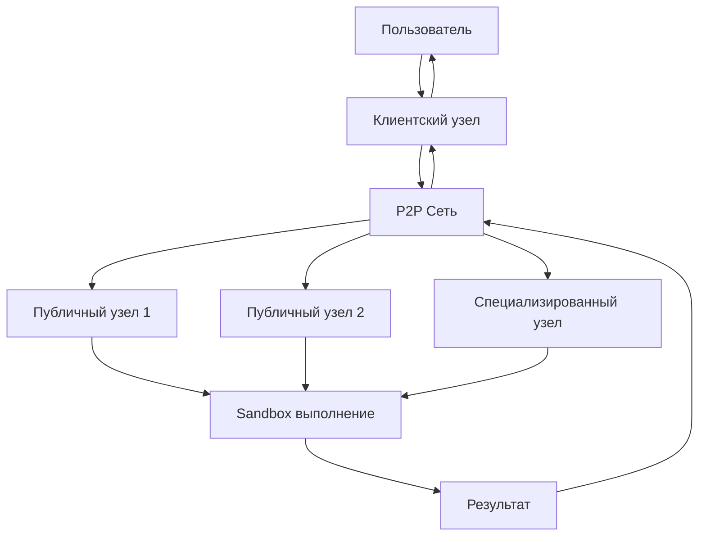
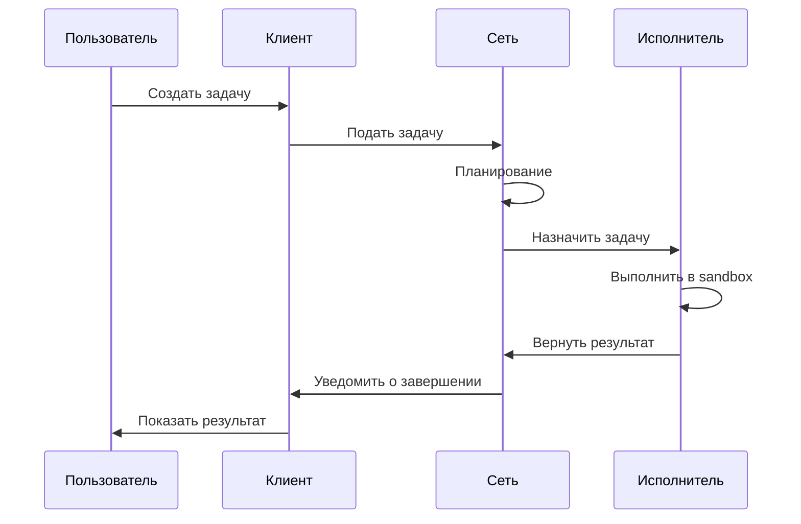

# 🚀 Децентрализованная P2P Вычислительная Сеть

Добро пожаловать в официальную документацию децентрализованной P2P вычислительной сети! Здесь вы найдете всю необходимую информацию для установки, использования и эксплуатации системы.

---

## 🎯 Что это такое?

Децентрализованная P2P вычислительная сеть - это распределенная система, позволяющая пользователям обмениваться вычислительными ресурсами без посредников. Каждый узел в сети может быть как потребителем, так и поставщиком вычислительных мощностей.

### Ключевые особенности

- ✅ **Децентрализация** - нет единого центра управления
- ✅ **P2P архитектура** - прямое взаимодействие узлов
- ✅ **Compute-кредиты** - система учета ресурсов без денег
- ✅ **Sandbox изоляция** - безопасное выполнение кода
- ✅ **Динамическое ценообразование** - адаптивные цены
- ✅ **Репутационная система** - защита от злоупотреблений
- ✅ **Масштабируемость** - горизонтальное масштабирование
- ✅ **Высокая доступность** - отказоустойчивость

### Архитектура системы

```
┌─────────────────────────────────────────────────────────────┐
│                    Децентрализованная сеть                   │
├─────────────────────────────────────────────────────────────┤
│  ┌─────────────┐  ┌─────────────┐  ┌─────────────┐          │
│  │   Узел 1    │  │   Узел 2    │  │   Узел 3    │  ...      │
│  └─────────────┘  └─────────────┘  └─────────────┘          │
│           │              │              │                   │
│  ┌─────────────────────────────────────────────────┐        │
│  │              P2P Сеть                           │        │
│  │  (Discovery, Routing, Message Passing)          │        │
│  └─────────────────────────────────────────────────┘        │
├─────────────────────────────────────────────────────────────┤
│                      Уровень сервисов                        │
│  ┌─────────────┐  ┌─────────────┐  ┌─────────────┐          │
│  │ Планировщик │  │ Мониторинг  │  │ Ценообразо- │          │
│  │   задач     │  │   сети      │  │    вание    │          │
│  └─────────────┘  └─────────────┘  └─────────────┘          │
├─────────────────────────────────────────────────────────────┤
│                          Ядро                               │
│  ┌─────────────┐  ┌─────────────┐  ┌─────────────┐          │
│  │   Узлы      │  │   Задачи    │  │ Кредиты     │          │
│  └─────────────┘  └─────────────┘  └─────────────┘          │
│  ┌─────────────┐  ┌─────────────┐  ┌─────────────┐          │
│  │ Репутация   │  │ Sandbox     │  │ Сеть        │          │
│  └─────────────┘  └─────────────┘  └─────────────┘          │
└─────────────────────────────────────────────────────────────┘
```

---

## 📚 Быстрый старт

### Установка

```bash
# Клонирование репозитория
git clone https://github.com/ari3lYT/p2pnet.git
cd p2pnet

# Создание виртуального окружения
python3 -m venv venv
source venv/bin/activate

# Установка зависимостей
pip install -r requirements.txt

# Запуск сети
python -m main
```

### Первое использование

```python
import asyncio
from src.main import ComputeNetwork
from src.core.task import Task, TaskType, TaskPriority

async def main():
    # Создание сети
    network = ComputeNetwork(host="127.0.0.1", port=5557)
    
    try:
        await network.start()
        await asyncio.sleep(2)
        
        # Создание задачи
        task = Task.create_range_reduce(
            owner_id=network.node.node_id,
            start=1,
            end=1000,
            operation="sum",
            requirements={
                "cpu_percent": 50.0,
                "ram_gb": 0.5,
                "timeout_seconds": 30
            },
            config={
                "max_price": 0.1,
                "priority": TaskPriority.NORMAL.value
            }
        )
        
        # Подача задачи
        task_id = await network.submit_task(task.to_dict())
        print(f"✅ Задача создана: {task_id}")
        
        # Ожидание завершения
        while True:
            status = await network.get_task_status(task_id)
            if status['status'] == 'completed':
                result = await network.get_task_result(task_id)
                print(f"🎉 Результат: {result}")
                break
            await asyncio.sleep(1)
            
    finally:
        await network.stop()

asyncio.run(main())
```

### Docker развертывание

```bash
# Сборка образа
docker build -t compute-network:latest .

# Запуск контейнера
docker run -d \
    --name compute-network \
    -p 5557:5557 \
    -p 8080:8080 \
    compute-network:latest
```

---

## 📖 Структура документации

### 🚀 Начало работы

- **[Руководство для начинающих](getting-started.md)** - Полное руководство по установке и первому запуску
- **[Архитектура системы](architecture.md)** - Подробное описание архитектуры и компонентов
- **[API Справочник](api-reference.md)** - Полное описание API и примеры использования

### 🛠️ Развертывание и эксплуатация

- **[Развертывание](deployment.md)** - Руководство по развертыванию в различных средах
- **[Примеры использования](examples.md)** - Примеры кода и сценарии использования
- **[Конфигурация](deployment.md#конфигурация)** - Детальная информация о настройке

### 🔧 Разработка

- **[Разработка](development.md)** - Руководство для разработчиков
- **[Тестирование](testing.md)** - Информация о тестировании и CI/CD
- **[Расширение системы](extension.md)** - Создание кастомных модулей

### 📊 Мониторинг и поддержка

- **[Мониторинг](deployment.md#мониторинг-и-логирование)** - Настройка мониторинга и логирования
- **[Отладка](examples.md#отладка-и-диагностика)** - Инструменты и методы отладки
- **[Производительность](examples.md#производительность)** - Оптимизация и нагрузочное тестирование
- **[Безопасность](examples.md#безопасность)** - Рекомендации по безопасности

---

## 🎯 Основные возможности

### Типы задач

Система поддерживает различные типы вычислительных задач:

- **Range Reduce** - Операции над диапазонами чисел
- **Map** - Параллельное отображение данных
- **Map Reduce** - Map-reduce операции
- **Matrix Operations** - Операции с матрицами
- **ML Inference** - Инференс нейронных сетей
- **ML Train Step** - Шаги обучения ML моделей

### Типы узлов

- **Seed-узлы** - Доверенные bootstrap узлы
- **Публичные узлы** - Узлы с белым IP
- **Клиентские узлы** - Обычные пользователи
- **Специализированные узлы** - Узлы с уникальными возможностями

### Система безопасности

- **Sandbox изоляция** - WebAssembly, Container, Process
- **Шифрование** - TLS 1.3, AES-256-GCM
- **Аутентификация** - Сертификаты, RBAC
- **Мониторинг угроз** - Обнаружение аномалий

### Масштабируемость

- **Горизонтальное масштабирование** - Добавление новых узлов
- **Вертикальное масштабирование** - Увеличение ресурсов
- **Балансировка нагрузки** - Распределение задач
- **Кэширование** - Ускорение повторяющихся операций

---

## 🎨 Визуализация

### Схема взаимодействия



### Жизненный цикл задачи



---

## 📊 Метрики и статистика

### Производительность

- **Время выполнения задач** - от миллисекунд до минут
- **Успешность выполнения** - > 99% при правильной настройке
- **Скорость обработки** - тысячи задач в секунду
- **Задержка сети** - миллисекунды

### Масштаб

- **Количество узлов** - от 1 до тысяч
- **Объем данных** - от килобайт до терабайтов
- **Количество задач** - от единиц до миллионов
- **Пропускная способность** - гигабиты в секунду

### Надежность

- **Доступность сети** - > 99.9%
- **Отказоустойчивость** - автоматическое восстановление
- **Консистентность данных** - гарантии согласованности
- **Восстановление после сбоев** - автоматическое восстановление

---

## 🌟 Примеры использования

### Научные вычисления

```python
# Параллельные вычисления для научных исследований
task = Task.create_range_reduce(
    owner_id="research_lab",
    start=1,
    end=1000000,
    operation="complex_calculation",
    requirements={
        "cpu_percent": 90.0,
        "ram_gb": 16.0,
        "gpu_percent": 80.0
    }
)
```

### Обработка данных

```python
# Обработка больших массивов данных
task = Task.create_map(
    owner_id="data_company",
    data=large_dataset,
    operation="data_transformation",
    requirements={
        "cpu_percent": 70.0,
        "ram_gb": 8.0,
        "timeout_seconds": 300
    }
)
```

### Машинное обучение

```python
# Обучение нейронных сетей
task = Task.create_ml_train_step(
    owner_id="ml_team",
    model_path="models/resnet50.h5",
    training_data=training_dataset,
    requirements={
        "cpu_percent": 50.0,
        "ram_gb": 32.0,
        "gpu_percent": 90.0,
        "timeout_seconds": 3600
    }
)
```

### Веб-приложения

```python
# Бэкенд для веб-приложения
@app.route('/api/process')
def process_data():
    task = Task.create_range_reduce(
        owner_id=request.user_id,
        start=1,
        end=request.data_size,
        operation=request.operation,
        requirements={
            "cpu_percent": 50.0,
            "ram_gb": 2.0
        }
    )
    return {"task_id": task.task_id}
```

---

## 🔧 Интеграции

### Docker

```dockerfile
FROM python:3.9-slim
RUN pip install compute-network
COPY app.py /app/
CMD ["python", "/app.py"]
```

### Kubernetes

```yaml
apiVersion: apps/v1
kind: Deployment
metadata:
  name: compute-network
spec:
  replicas: 3
  selector:
    matchLabels:
      app: compute-network
  template:
    metadata:
      labels:
        app: compute-network
    spec:
      containers:
      - name: compute-network
        image: compute-network:latest
        ports:
        - containerPort: 5557
```

### Cloud Platforms

- **AWS** - EC2, ECS, EKS
- **Google Cloud** - GCE, GKE, Cloud Run
- **Azure** - VMs, AKS, Container Instances

---

## 📈 Сценарии использования

### 1. Распределенные вычисления

**Проблема:** Требуются большие вычислительные мощности для научных расчетов.

**Решение:** Использовать сеть для распределения вычислений по множеству узлов.

**Преимущества:**
- Снижение стоимости вычислений
- Ускорение обработки
- Гибкое масштабирование

### 2. Обработка больших данных

**Проблема:** Обработка больших объемов данных требует значительных ресурсов.

**Решение:** Разбить данные на чанки и обработать параллельно.

**Преимущества:**
- Линейное ускорение с количеством узлов
- Обработка данных, не помещающихся в память одного узла
- Устойчивость к сбоям

### 3. ML/AI вычисления

**Проблема:** Обучение и инференс ML моделей требует GPU и большого объема RAM.

**Решение:** Использовать специализированные узлы с GPU.

**Преимущества:**
- Доступ к GPU вычислениям
- Параллельное обучение
- Оптимизация затрат

### 4. Edge Computing

**Проблема:** Обработка данных на граничных устройствах с ограниченными ресурсами.

**Решение:** Использовать сеть для offloading вычислений.

**Преимущества:**
- Снижение нагрузки на edge устройства
- Улучшение отклика
- Эффективное использование ресурсов

---

## 🎯 Сообщество

### Ресурсы

- **GitHub Repository**: [github.com/ari3lYT/p2pnet](https://github.com/ari3lYT/p2pnet)
- **Документация**: [d2omg.ru/p2p/](https://d2omg.ru/p2p/)
- **Форум**: [p2p.d2omg.ru/forum](https://p2p.d2omg.ru/forum)
- **Чат**: [p2p.d2omg.ru/chat](https://p2p.d2omg.ru/chat)

### Вклад в развитие

Мы приветствуем вклад в развитие проекта!

1. **Форкните** репозиторий
2. **Создайте** ветку для вашей функции
3. **Внесите** изменения
4. **Создайте** Pull Request
5. **Обсудите** изменения с командой

### Лицензия

Проект распространяется под лицензией MIT License. Подробности см. в файле [LICENSE](LICENSE).

---

## 🚀 Быстрый старт с Docker

```bash
# Клонирование репозитория
git clone https://github.com/ari3lYT/p2pnet.git
cd p2pnet

# Сборка образа
docker build -t compute-network:latest .

# Запуск seed-узла
docker run -d \
    --name seed-node \
    -p 5557:5557 \
    -e NODE_TYPE=seed \
    compute-network:latest

# Запуск рабочего узла
docker run -d \
    --name worker-node \
    -p 5558:5557 \
    -e NODE_TYPE=public \
    -e SEED_NODES=seed:5557 \
    compute-network:latest

# Запуск веб-интерфейса
docker run -d \
    --name web-ui \
    -p 8080:8080 \
    -e SEED_NODES=seed:5557 \
    compute-network:latest
```

---

## 📞 Техническая поддержка

### Каналы поддержки

- **Email**: [ari3l@d2omg.ru](mailto:ari3l@d2omg.ru)
- **Telegram**: [@gweles](https://t.me/gweles)
- **GitHub Issues**: [github.com/ari3lYT/p2pnet/issues](https://github.com/ari3lYT/p2pnet/issues)

### Отчет об ошибках

При обнаружении ошибок, пожалуйста, предоставьте:

1. Версию системы
2. Конфигурацию узла
3. Логи ошибок
4. Шаги воспроизведения
5. Ожидаемый и фактический результат

### Запросы функций

Мы всегда рады новым идеям! Создавайте issue с тегом `feature-request` для предложений по улучшению.

---

## 🎉 Заключение

Децентрализованная P2P вычислительная сеть предоставляет мощную и гибкую платформу для распределенных вычислений. Система готова к использованию в различных сценариях - от научных исследований до промышленных приложений.

### Ключевые преимущества

- **Инновационная архитектура** - P2P сеть с compute-кредитами
- **Высокая производительность** - оптимизированная для параллельных вычислений
- **Легкая интеграция** - простые API и готовые примеры
- **Масштабируемость** - от одного узла до тысяч
- **Безопасность** - многоуровневая защита

**Начните использовать Compute Network сегодня и откройте новые возможности для ваших вычислений!**

---

## 📄 Дополнительно

### Ссылки

- [GitHub Repository](https://github.com/ari3lYT/p2pnet)
- [Официальный сайт](https://p2p.d2omg.ru)
- [Демо-версия](https://p2p.d2omg.ru)
- [Блог](https://p2p.d2omg.ru/blog)

### Приложения

- **[Compute Network CLI](https://github.com/ari3lYT/p2pnet-cli)** - Командная строка
- **[Compute Network Web UI](https://github.com/ari3lYT/p2pnet-web)** - Веб-интерфейс
- **[Compute Network SDK](https://github.com/ari3lYT/p2pnet-sdk)** - SDK для разных языков

---

*Последнее обновление: December 2025*
*Версия: 1.0.0*